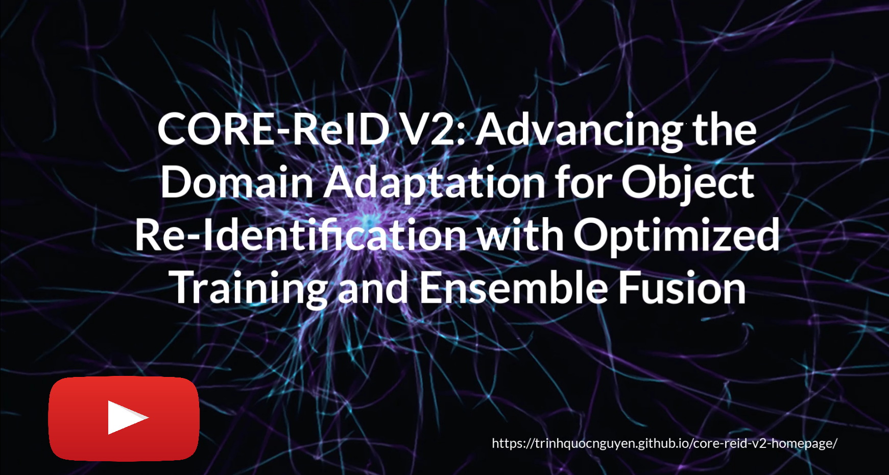

[](https://paperswithcode.com/sota/unsupervised-domain-adaptation-on-cuhk03-to-1?p=core-reid-comprehensive-optimization-and)

[](https://paperswithcode.com/sota/unsupervised-domain-adaptation-on-cuhk03-to?p=core-reid-comprehensive-optimization-and)

[](https://paperswithcode.com/sota/unsupervised-person-re-identification-on-1?p=core-reid-comprehensive-optimization-and)

[](https://paperswithcode.com/sota/unsupervised-person-re-identification-on-3?p=core-reid-comprehensive-optimization-and)

[](https://paperswithcode.com/sota/unsupervised-domain-adaptation-on-duke-to?p=core-reid-comprehensive-optimization-and)

[](https://paperswithcode.com/sota/unsupervised-domain-adaptation-on-duke-to-1?p=core-reid-comprehensive-optimization-and)

[](https://paperswithcode.com/sota/unsupervised-person-re-identification-on?p=core-reid-comprehensive-optimization-and)

[](https://paperswithcode.com/sota/unsupervised-person-re-identification-on-2?p=core-reid-comprehensive-optimization-and)

[](https://paperswithcode.com/sota/unsupervised-domain-adaptation-on-market-to-6?p=core-reid-comprehensive-optimization-and)

[](https://paperswithcode.com/sota/unsupervised-domain-adaptation-on-market-to?p=core-reid-comprehensive-optimization-and)

[](https://paperswithcode.com/sota/unsupervised-domain-adaptation-on-market-to-1?p=core-reid-comprehensive-optimization-and)

# CORE-ReID
**CORE-ReID: Comprehensive Optimization and Refinement through Ensemble fusion in Domain Adaptation for person re-identification**


Our project page: https://trinhquocnguyen.github.io/core-reid-homepage/

**[2025/04/30: Good News!]**     

* We have developed the second version of CORE-ReID, the performance is much better, check it [here](https://github.com/TrinhQuocNguyen/CORE-ReID-V2) ❤️.

## TODO
- [X] Explain step by step how to run the source code with tutorial videos
- [X] Update Readme.md file
- [X] Fix the absolute path
- [X] Initialize the source code

## Updates
- **[2024/12/01: Good News!]** 
    * We have developed the second version of CORE-ReID, the performance is much better, please stay in tune.
- **[2024/07/14: Source code is released!]** 
    * The first version of source code has been initialized.
- **[2024/06/03: CORE-ReID is published by MDPI!]**
    * The paper of CORE-ReID is publised by MDPI: https://www.mdpi.com/2674-113X/3/2/12 
- **[2024/05/27: CORE-ReID is accepted by MDPI!]**
    * The paper of CORE-ReID is accepted by MDPI.

## Installation
This codebase has been developed with python version 3.8, PyTorch version 1.8.1, CUDA 12.1 and torchvision 0.9.1
- pip:
    - contourpy==1.1.1
    - cycler==0.12.1
    - fonttools==4.53.0
    - h5py==3.11.0
    - importlib-resources==6.4.0
    - joblib==1.4.2
    - kiwisolver==1.4.5
    - matplotlib==3.7.5
    - numpy==1.21.6
    - opencv-python==4.4.0.46
    - packaging==24.1
    - pillow==9.1.0
    - pyparsing==3.1.2
    - python-dateutil==2.9.0.post0
    - scikit-learn==1.0.2
    - scipy==1.9.3
    - six==1.16.0
    - threadpoolctl==3.5.0
    - torch==1.8.1
    - torchvision==0.9.1
    - typing-extensions==4.12.2
    - zipp==3.19.2
- We used serveral servers to train the models:
    - NVIDIA Quadro RTX 8000 x 2


## Training 
### 1. Train CycleGAN models
- For Person ReID, Follow the guidance from: [camstyle-for-person-reid](https://github.com/TrinhQuocNguyen/camstyle-for-person-reid)
### 2. Generate the training datataset
- For Person ReID, Follow the guidance from: [camstyle-for-person-reid](https://github.com/TrinhQuocNguyen/camstyle-for-person-reid)
### 3. Train the ReID model - Step 1: Pretraining on Source Domain
For example, fine-tune DUKE => MARKET1501 with Resnet101 architecture:
```
CUDA_VISIBLE_DEVICES=1,2 python source_pretrain.py -ds duke -dt market \
                  --data-dir /home/ccvn/Workspace/trinh/data/reid \ 
                  --logs-dir logs/duke2market_101_all_merge_ECAB_Z/source_pretraining -b 128 \
                  --arch resnet101_source
```
### 4. Train the ReID model - Step 2: Fine-Tuning on Target Domain
For example, fine-tune DUKE => MARKET1501 with Resnet101 architecture:
```
CUDA_VISIBLE_DEVICES=1,2 python target_train.py -dt market \
                 --data-dir /home/ccvn/Workspace/trinh/data/reid \
                 --logs-dir logs/duke2market_101_all_merge_ECAB_Z/target_fine_tuning_ECAB_BMFN_Local_Loss \
                 --initial-weights logs/duke2market_101_all_merge_ECAB_Z/source_pretraining -b 128 \
                 --num-clusters 700 --arch resnet101
```
### 5. Train the ReID model - Step 3: Evaluation on Target Domain
For example, test DUKE => MARKET1501 with Resnet101 architecture:
```
CUDA_VISIBLE_DEVICES=1,2 python model_test.py -dt market \
                --data-dir /home/ccvn/Workspace/trinh/data/reid \
                --resume logs/duke2market_101_all_merge_ECAB_Z/target_fine_tuning_ECAB_BMFN/model_best.pth.tar \
                --num-classes 700 --arch resnet101
```
### 6. Tutorials
Watch the Tutorial (From CORE-ReID V2):

[](https://youtu.be/bVyPntMedLQ)

## Citations
Please cite our paper if you find it useful
```
@article{,
  author    = {Nguyen TQ, Prima ODA, Hotta K},
  title     = {CORE-ReID: Comprehensive Optimization and Refinement through Ensemble Fusion in Domain Adaptation for Person Re-Identification.},
  journal   = {Software},
  doi       = {https://doi.org/10.3390/software3020012},
  volume    = {3},
  pages     = {227-249},
  year      = {2024},
}
```

## Acknowledgement
Thank you for great works below:
- [open-reid](https://github.com/Cysu/open-reid)
- [MEB-Net](https://github.com/YunpengZhai/MEB-Net)
- [LF2](https://github.com/DJEddyking/LF2)
- [CBAM](https://github.com/luuuyi/CBAM.PyTorch)
